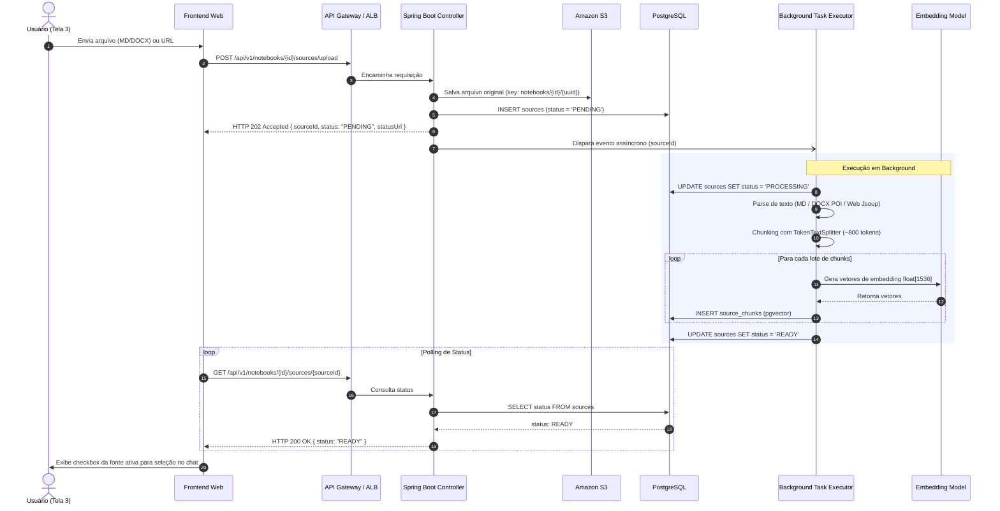
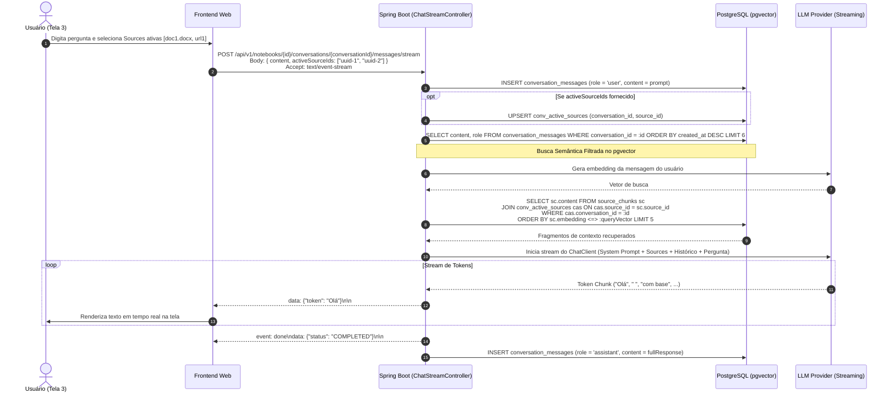

# Arquitetura do Sistema (ARCHITECTURE.md)

Este documento descreve a visão de alto nível da arquitetura em nuvem, o relacionamento entre serviços e os princípios arquiteturais fundamentais da plataforma **NotebookLM Simplificado**.

Para detalhes aprofundados sobre dados e regras de negócio, consulte o **[`DOMAIN.md`](file:///Users/ltcloud/Documents/Outros/Java/llm/DOMAIN.md)**. Para os contratos detalhados de endpoints e streaming, consulte o **[`API.md`](file:///Users/ltcloud/Documents/Outros/Java/llm/API.md)**.

---

## 1. Visão Geral da Arquitetura em Nuvem

O sistema adota uma arquitetura em nuvem **AWS**, orientada a microsserviços **100% stateless**, altamente escalável e resiliente, unindo processamento transacional relacional e busca semântica vetorial em um único banco de dados PostgreSQL com `pgvector`.

```
                                      NUVEM AWS
  +------------------+         +---------------------+
  |   Frontend Web   |  OIDC   |  AWS Cognito IdP    |
  |  (React/Next.js) +<=======>+ - Google Federation |
  +--------+---------+         | - GitHub Federation |
           |                   +---------------------+
           | Bearer JWT (Stateless)
           v
  +------------------+
  |  API Gateway     |
  +--------+---------+
           |
           v
  +------------------+
  | Application      |
  | Load Balancer    |
  +--------+---------+
           |
           v
  +-------------------------------------------------------------+
  | Spring Boot 3.3+ Backend Stateless (ECS Fargate / Docker)   |
  | - Spring Security OAuth2 Resource Server (Validação JWKS)   |
  | - Spring Data JPA & ThreadPool Assíncrono                   |
  | - Spring AI (ChatClient, PgVectorStore & TokenTextSplitter) |
  +----+----------------------+--------------------------+------+
       |                      |                          |
       v                      v                          v
  +----+------+        +------+-------+        +---------+---------+
  | Amazon S3 |        | PostgreSQL   |        | Provedor de LLM   |
  | Bucket    |        | + pgvector   |        | (Invisível)       |
  | (Raw Docs)|        | (HNSW Index) |        | Bedrock/OpenRouter|
  +-----------+        +--------------+        +-------------------+
```

---

## 2. Invariantes Arquiteturais

1. **Backend 100% Stateless:**
   - O servidor Spring Boot não armazena sessões HTTP em memória (`SessionCreationPolicy.STATELESS`).
   - Toda requisição é autenticada através de tokens JWT emitidos pelo **AWS Cognito User Pool**.
   - O backend valida a assinatura dos tokens de forma stateless via chaves públicas (JWKS).
2. **Padrão Async Request-Reply na Ingestão:**
   - O upload de fontes (Markdown, DOCX, Web URLs) é não-bloqueante. A API responde imediatamente com **`HTTP 202 Accepted`** e o processamento de texto, chunking e embeddings é executado em background.
3. **Persistência Unificada com PostgreSQL + pgvector:**
   - Elimina a necessidade de bancos vetoriais isolados. Dados relacionais (`users`, `notebooks`, `sources`, `chat_sessions`) e fragmentos com vetores (`source_chunks`) coexistem no mesmo banco, viabilizando filtros relacionais nativos (`notebook_id` e `source_id`) em conjunto com busca de cossenos por índice **HNSW**.
4. **Provedor de LLM Transparente e Invisível:**
   - A escolha entre AWS Bedrock Converse, OpenRouter ou OpenAI é feita exclusivamente em nível de sistema (`application.yml` / variáveis de ambiente), sendo 100% oculta e transparente para o usuário final.
5. **Streaming Reativo via Server-Sent Events (SSE):**
   - O chat transmite tokens gerados em tempo real através do protocolo SSE (`text/event-stream`), garantindo baixa latência percebida e compatibilidade com proxies e balanceadores HTTP.

---

## 3. Relacionamento Entre Componentes e Serviços

| Serviço / Componente | Papel no Sistema | Integrações Diretas |
|---|---|---|
| **AWS Cognito** | Provedor de Identidade (IdP) e SSO com Google e GitHub. Emite tokens JWT no fluxo Authorization Code + PKCE. | Frontend Web (Login na Tela 1) e Spring Boot (validação via JWKS). |
| **API Gateway** | Ponto único de entrada pública, limitação de taxa (throttling), terminação SSL e roteamento. | Frontend Web $\rightarrow$ ALB. |
| **Application Load Balancer (ALB)** | Distribuição de carga uniforme entre as instâncias stateless dos containers. | API Gateway $\rightarrow$ Containers Spring Boot no ECS Fargate. |
| **Spring Boot Backend** | Núcleo da lógica de negócio, autenticação stateless, orquestração assíncrona, RAG e streaming SSE. | ALB, Amazon S3, PostgreSQL e Provedor de LLM. |
| **Amazon S3** | Armazenamento de arquivos originais brutos enviados pelos usuários. | Spring Boot Backend (upload direto com chave `notebooks/{id}/{uuid}`). |
| **PostgreSQL 16 + pgvector** | Armazenamento relacional e repositório de vetores de embedding com índice HNSW. | Spring Boot Backend (Spring Data JPA e `PgVectorStore`). |
| **Provedor de LLM** | Geração de embeddings e inferência conversacional de streaming compatível com contrato OpenAI. | Spring Boot Backend (Spring AI `ChatClient`). |

---

## 4. Telas do Sistema vs. Fluxos Arquiteturais

| Tela | Nome | Funcionalidade Principal | Serviços AWS Envolvidos |
|---|---|---|---|
| **Tela 1** | **Login SSO** | Autenticação federada com Google e GitHub via Cognito Hosted UI com PKCE. | AWS Cognito User Pool. |
| **Tela 2** | **Dashboard Notebooks** | Listagem de notebooks do usuário, botão "+ Criar", navegação para o notebook. | API Gateway $\rightarrow$ ALB $\rightarrow$ Spring Boot $\rightarrow$ PostgreSQL. |
| **Tela 3** | **Workspace (Sources + Chat)** | Painel esquerdo: upload (MD/DOCX/URL), listagem de fontes e seleção ativa.<br/>Painel direito: histórico e streaming SSE de respostas. | API Gateway $\rightarrow$ ALB $\rightarrow$ Spring Boot $\rightarrow$ S3, PostgreSQL pgvector e LLM Provider. |

---

## 5. Sequência do Padrão Async Request-Reply (Ingestão)



---

## 6. Sequência de Chat RAG com Filtro de Sources e SSE



---

## 7. Configuração do Provedor de LLM Invisível

O backend utiliza a abstração OpenAI-compatible do Spring AI para permitir a alternância imediata de provedores na nuvem ou em desenvolvimento sem impacto para o usuário:

```yaml
spring:
  ai:
    openai:
      base-url: ${AI_PROVIDER_BASE_URL:https://openrouter.ai/api/v1}
      api-key: ${AI_PROVIDER_API_KEY}
      chat:
        options:
          model: ${AI_MODEL_CHAT:anthropic/claude-3.5-sonnet}
          temperature: 0.2
      embedding:
        options:
          model: ${AI_MODEL_EMBEDDING:text-embedding-3-small}
```
Isso permite apontar para **AWS Bedrock Converse**, **OpenRouter** ou **OpenAI** alterando apenas variáveis de ambiente no container stateless.
